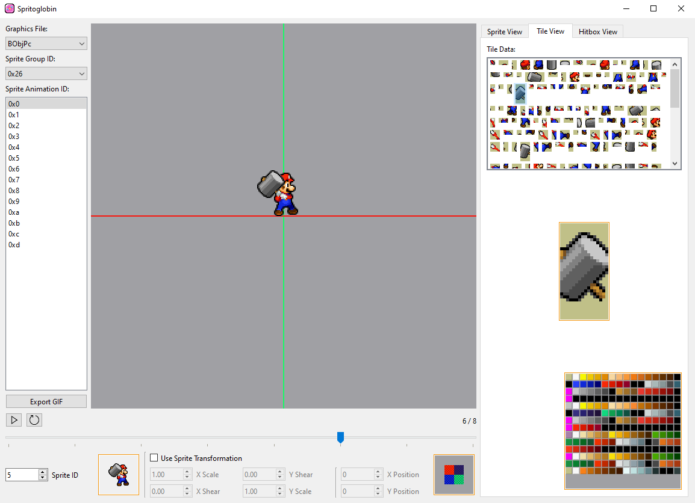

# Spritoglobin
Spritoglobin is a sprite viewer for North American and European versions of Mario and Luigi: Bowser's Inside Story.



This program is still in development, and likely to be deprecated before it's feature-complete.
I'm mostly just uploading this version because it's still got a lot of use on its own, even though it's missing so many editor features and saving isn't implemented quite yet.
All of Spritoglobin's testing was done on the North American version of the ROM, so issues may arise while viewing the European version.

Spritoglobin icon created by MiiK: https://bsky.app/profile/miikheaven.bsky.social

# Running the Program
There are 4 ways to run this program, from easiest to most complicated:

1. Download the binary from [Releases](https://github.com/MnL-Modding/Spritoglobin/releases) and run it. (Use the `.exe` for Windows, and the `.bin` for Linux)

2. Install the package with
```bash
python3 -m pip install --force-reinstall git+https://github.com/MnL-Modding/Spritoglobin
```
and run it with `spritoglobin` or `python3 -m spritoglobin`.

3. Clone the repository, install the dependencies with Poetry (assuming you already have Poetry installed with `python3 -m pip install poetry`):
```bash
poetry install
```
and run the program through Poetry:
```bash
poetry run spritoglobin
```

4. Clone the repository, install the dependencies through `pip` with:
```bash
python3 -m pip install -r requirements.txt
```
and run it from the current directory with `python3 -m spritoglobin`. Alternatively, it can be run through the `run.bat` if you use Windows.
